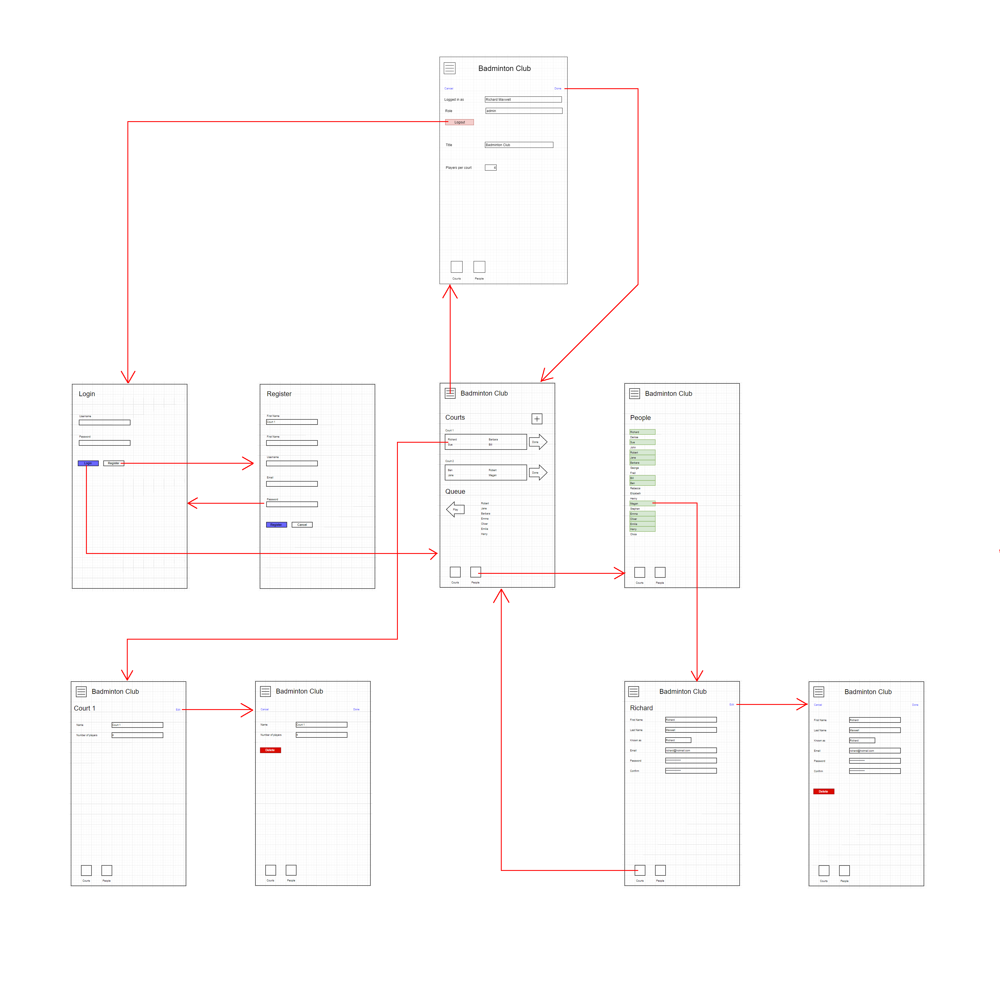

# Players

## Introduction

The `players` application is intended to be used by a group of players of badminton, tennis,squash (or similar court based game) to decide who should play should play nex when a court becomes available. There are a number of courts, on each of which a number of players may play (usually either 2 or 4), and a larger number of players available to play. The players are organised into a queue, such that the players at the top of the queue are eligable to play first. Players who finish playing a game on a court are moved to the bottom of the queue and a new set of playes are selected from the top of the queue to play on the court.

The system is a client/server design, where the state is held on the server and many players (but not necessarily all) run a client on their mobile device. The server maintains a counter which clients can use to check if their state is up-to-date. The server only accepts updates from devices which have up-to-date state. Other clients must update their state from the server and retry the update.

The server initially points to an empty state, containing no courts, no properties and no players. Users login via their mobile device. At least one user has `admin` rights and has full write access to the system. Other users have limited write access to the system.

## Client 
navigation: 



## Server

The server secures credentials on disk by storing them as `hash + salt + algorithm`.

The `private` fields of the `person` object (`email`, `hash`, `salt`, `algorithm`) are never sent to the client.

The keys into the `Person` and `Court` objects are incrementing integers. 

This is an example of how the data might be stored on disk by the server 
``` json
{
    "general": {
        "title": "Badminton Club",
        "version": 123456,
    },
    "people": {
        "list": {
            "007": {
                "firstname": "James",
                "lastname": "Bond",
                "userID": "james",
                "player": true,
                "private": {
                    "email": "james@mi6.co.uk",
                    "hash": "65e84be33532fb784c48129675f9eff3a682b27168c0ea744b2cf58ee02337c5"
                }
            },
            "another": { "..." }
        }
    },
    "courts": {
        "nextID": 35,  
        "playersPerCourt": 4,      
        "list": {
            "34": { 
                "name": "Court 1", 
                "players": [ "007", "bob", "alice", "jill" ] 
            },
            "another": { "..." }
        }
    }
}
```


## REST API

API requests are secured during transmission by sending them over HTTPS.

The following shell variables are examples of variables which are assumed by the REST API examples 

``` bash
USER="007"
PASSWORD="topsecret"
ENDPOINT="https://api.example.com"
```

#### Generic Good Response
``` json
{
    "code": 0
}
```

#### Generic Error Response
``` json
{
    "code": 123456,
    "message": "Bad credentials" 
}
```

[//]: # (************************************************************)
[//]: # (*)
[//]: # (* Registration)
[//]: # (*)
[//]: # (************************************************************)

### Register

``` bash
COMMAND="/register"

cat <<EOT > data.json
{  
    "userID": "007",
    "first_name": "James",
    "last_name": "Bond",
    "email": "james@mi6.co.uk",
    "password": "topsecret"
}
EOT

curl -X POST ${ENDPOINT}${COMMAND} \
--header "Content-Type: application/json" \
--data-binary @data.json
```

### Login

The login call requires the userID/password to be supplied for basic http authentication. A token is returned which must be used to authenticate subsequent calls

``` bash
COMMAND="/login"

curl -X GET -u "${USERID}:${PASSWORD}" ${ENDPOINT}${COMMAND} \
--header "Content-Type: application/json" \
--header "Accept: application/json"
```

``` json
httpStatus: 200
response:
{
    "token": "4acRtD1Bai5Gr83gAAEl"
}
```

### Logout

The logout call invalidates the token 

``` bash
COMMAND="/logout"

cat <<EOT > data.json
{
    "token": "4acRtD1Bai5Gr83gAAEl"
}
EOT

curl -X DELETE ${ENDPOINT}${COMMAND} \
--header "Content-Type: application/json" \
--data-binary @data.json
```

[//]: # (************************************************************)
[//]: # (*)
[//]: # (* General)
[//]: # (*)
[//]: # (************************************************************)

### Read All

``` bash
COMMAND=""

cat <<EOT > data.json
{
    "token": "4acRtD1Bai5Gr83gAAEl"
}
EOT

curl -X GET ${ENDPOINT}${COMMAND} \
--header "Content-Type: application/json" \
--header "Accept: application/json" \
--data-binary @data.json
```

``` json
httpStatus: 200
response:
{
    "general": {
        "title": "Badminton Club",
        "players_per_court": 4,
        "version": 123456
    },
    "people": {
        "123": {
            "first_name": "James",
            "last_name": "Bond",
            "userID": "james",
            "player": true
        },
        "another": { "..." }
    },
    "courts": {
        "34": { 
            "name": "Court 1", 
            "players": [ 123, 77, 23, 87 ] 
        },
        "another": { "..." }
    }
}
```


### Read People

``` bash
COMMAND="/people"

cat <<EOT > data.json
{
    "token": "4acRtD1Bai5Gr83gAAEl"
}
EOT

curl -X GET ${ENDPOINT}${COMMAND} \
--header "Content-Type: application/json" \
--header "Accept: application/json" \
--data-binary @data.json
```

``` json
httpStatus: 200
response:
{
    "people": {
        "123": {
            "first_name": "James",
            "last_name": "Bond",
            "userID": "james",
            "player": true
        },
        "another": { "..." }
    }
}
```


### Read Courts

``` bash
COMMAND="/courts"

cat <<EOT > data.json
{
    "token": "4acRtD1Bai5Gr83gAAEl"
}
EOT

curl -X GET ${ENDPOINT}${COMMAND} \
--header "Content-Type: application/json" \
--header "Accept: application/json" \
--data-binary @data.json
```

``` json
httpStatus: 200
response:
{
    "courts": {
        "34": { 
            "name": "Court 1", 
            "players": [ 123, 77, 23, 87 ] 
        },
        "another": { "..." }
    }
}
```


### Update General

The list of fields supplied in the data may be incomplete. Only the given fields will be updated

``` bash
COMMAND="/general"

cat <<EOT > data.json
{
    "token": "4acRtD1Bai5Gr83gAAEl",
    "general": {   
        "title": "Badminton Club",
        "players_per_court": 4
    }
}
EOT

curl -X PUT -u "${USERID}:${PASSWORD}" ${ENDPOINT}${COMMAND} \
--header "Content-Type: application/json" \
--data-binary @data.json
```

[//]: # (************************************************************)
[//]: # (*)
[//]: # (* Person)
[//]: # (*)
[//]: # (************************************************************)

### Update Person

The list of fields supplied in the data may be incomplete. Only the given fields will be updated

Only an `admin` user or the logged-in user can change most person fields.
However:
    Any logged-in user may set any person's `player` field
    Only an `admin` user may change the `status` field

A check will be made to make sure there is always at least 1 `admin` user

``` bash
COMMAND="/person/${ID}"

cat <<EOT > data.json
{
    "token": "4acRtD1Bai5Gr83gAAEl",
    "person": {
        "userID": "007",
        "firstname": "James",
        "lastname": "Bond",
        "email": "james@mi6.co.uk",
        "password": "topsecret",
        "status": "admin"
        "player": true        
    }    
}
EOT

curl -X PUT ${ENDPOINT}${COMMAND} \
--header "Content-Type: application/json" \
--data-binary @data.json
```

### Delete Person
``` bash
COMMAND="/person/${ID}"

cat <<EOT > data.json
{
    "token": "4acRtD1Bai5Gr83gAAEl"   
}
EOT

curl -X DELETE -u "${USERID}:${PASSWORD}" ${ENDPOINT}${COMMAND} \
--header "Content-Type: application/json" \
--data-binary @data.json
```

[//]: # (************************************************************)
[//]: # (*)
[//]: # (* Court)
[//]: # (*)
[//]: # (************************************************************)

### Create court
``` bash
COMMAND="/court"

cat <<EOT > data.json
{
    "token": "4acRtD1Bai5Gr83gAAEl",
    "court": {
        "name": "Court 1",
        "players": [ 123, 77, 23, 87 ] 
    }    
}
EOT

curl -X POST ${ENDPOINT}${COMMAND} \
--header "Content-Type: application/json" \
--data-binary @data.json
```

### Update Court

The list of fields supplied in the data may be incomplete. Only the given fields will be updated

``` bash
COMMAND="/court/${ID}"

cat <<EOT > data.json
{
    "token": "4acRtD1Bai5Gr83gAAEl",
    "court": {   
        "name": "Court 1",
        "players": [ 123, 77, 23, 87 ]  
    }
}
EOT

curl -X PUT ${ENDPOINT}${COMMAND} \
--header "Content-Type: application/json" \
--data-binary @data.json
```

### Delete Court
``` bash
COMMAND="/court/${ID}"

cat <<EOT > data.json
{
    "token": "4acRtD1Bai5Gr83gAAEl",
}
EOT

curl -X DELETE ${ENDPOINT}${COMMAND}  \
--header "Content-Type: application/json" \
--data-binary @data.json
```


